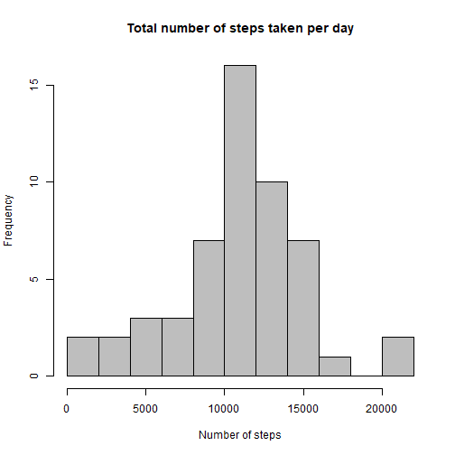
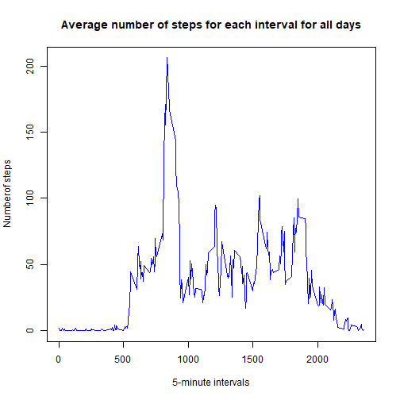
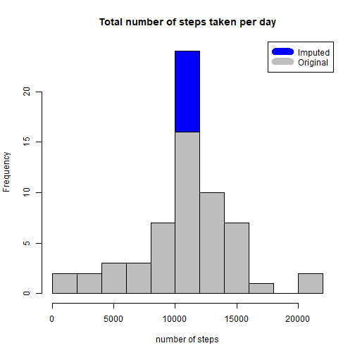
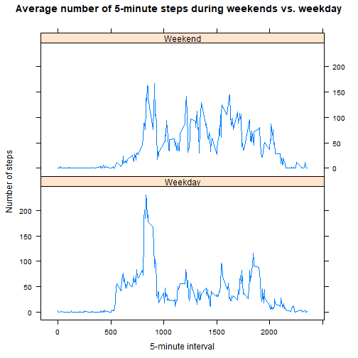

## Loading and preprocessing the data


```r
amd<-read.csv("activity.csv",header=TRUE,sep=",")
head(amd)
```

```
##   steps       date interval
## 1    NA 2012-10-01        0
## 2    NA 2012-10-01        5
## 3    NA 2012-10-01       10
## 4    NA 2012-10-01       15
## 5    NA 2012-10-01       20
## 6    NA 2012-10-01       25
```


## What is mean total number of steps taken per day?

```r
daily_steps<-aggregate(steps~date,data=amd,FUN=sum)
hist(daily_steps$steps,breaks=10,col="gray",xlab="Number of steps",main="Total number of steps taken per day")
```



```r
mean(daily_steps$steps,na.rm=TRUE)
```

```
## [1] 10766.19
```

```r
median(daily_steps$steps,na.rm=TRUE)
```

```
## [1] 10765
```


## What is the average daily activity pattern?

```r
five_minute_steps<-aggregate(steps~interval,data=amd,FUN=mean)
plot(five_minute_steps$interval,five_minute_steps$steps,type="l",col="blue",xlab="5-minute intervals",ylab="Numberof steps",main="Average number of steps for each interval for all days")
```



```r
max<-five_minute_steps[which.max(five_minute_steps$steps),1]
```
On average across all the days in the dataset, the 835th 5-minute interval contains the maximum number of steps.

## Imputing missing values
* Calculate and report the total number of missing values in the dataset.


```r
missing_count<-sum(is.na(amd$steps))
```

There are 2304 missing values in the dataset.

* Use the mean of each 5-minute interval across all the days to fill missing values.


```r
impute_data<-transform(amd, steps=ifelse(is.na(amd$steps), five_minute_steps$steps[match(amd$interval, five_minute_steps$interval)], amd$steps))
```

* Make a histogram of the total number of steps taken each day with new data and compared to the original data.


```r
daily_steps_imputed<-aggregate(steps~date,data=impute_data,FUN=sum)
hist(daily_steps_imputed$steps,breaks=10,col="blue",xlab="number of steps",main="Total number of steps taken per day")
hist(daily_steps$steps,breaks=10,col="gray",xlab="number of steps",add=T)
legend("topright",c("Imputed","Original"),col=c("blue","gray"),lwd=10)
```



* Calculate and report the mean and median total number of steps taken per day.

```r
mean(daily_steps_imputed$steps)
```

```
## [1] 10766.19
```

```r
median(daily_steps_imputed$steps)
```

```
## [1] 10766.19
```

With imputation, the mean total number of steps taken per day did not change, but median increased to the same value as the mean.

## Are there differences in activity patterns between weekdays and weekends?

* Create a new factor variable in the dataset with two levels - "weekday" and "weekend"

```r
weekend<-c("Saturday","Sunday")
impute_data$dow<-as.factor(ifelse(is.element(weekdays(as.Date(impute_data$date)),weekend),"Weekend","Weekday"))
```

* Make a panel for times series plot of the 5-minute interval average number of steps taken across weekdays and weekend.


```r
five_minute_steps2<-aggregate(steps~interval+dow,data=impute_data,FUN=mean)
library(lattice)
xyplot(five_minute_steps2$steps~five_minute_steps2$interval|five_minute_steps2$dow, main="Average number of 5-minute steps during weekends vs. weekday",xlab="5-minute interval", ylab="Number of steps",layout=c(1,2), type="l")
```



Comparing the above panel, we can see during weekdays, this person started walking earlier than weekends, probably walking to work. Also on average, this person stepped more during weekdays than weekends, suggesting more activities during weekdays.